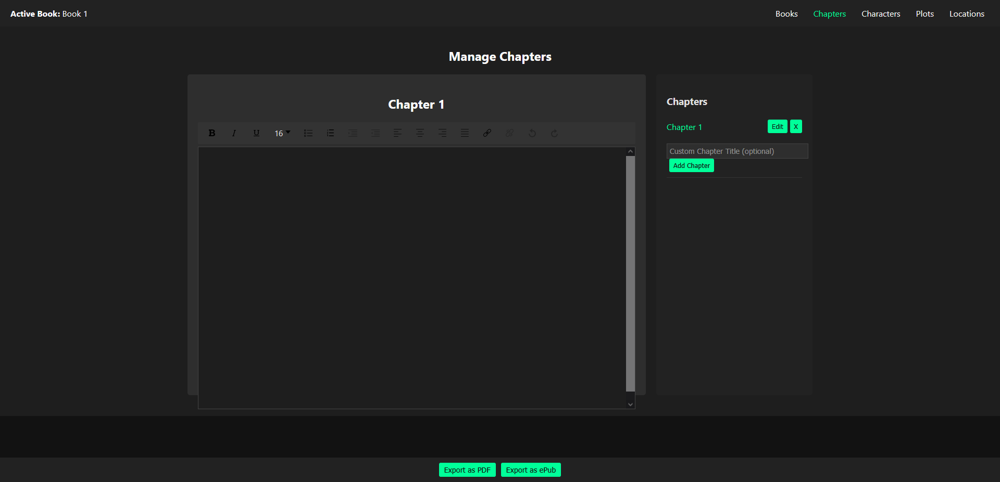

# EZ Novel

EZ Novel is a full-featured novel writing app designed to help you create, manage, and export your novel with ease. With its rich text editor, real-time autosave, and comprehensive management for chapters, characters, locations, and plot points, EZ Novel offers a powerful environment for authors to focus on their creativity.

## Features

- **Rich Text Editor:** Format your chapters with inline styles, font sizes, lists, text alignment, links, history, and more.
- **Chapter Management:** Create, edit, and manage chapters with real-time autosave.
- **Book Organization:** Manage multiple books, each with its own chapters, characters, locations, and plot points.
- **Export Options:** Export your novel as a PDF (and soon as an ePub) with a customizable filename that includes the book title and a timestamp.
- **Real-Time Autosave:** All your changes are automatically saved as you write.

## Screenshots





## Project Structure
````
ez_novel/
├── client/
│   ├── package.json
│   ├── package-lock.json
│   ├── public/
│   │   ├── favicon.ico
│   │   ├── index.html
│   │   ├── logo192.png
│   │   ├── logo512.png
│   │   ├── manifest.json
│   │   └── robots.txt
│   ├── README.md
│   └── src/
│       ├── App.css
│       ├── App.js
│       ├── index.css
│       ├── index.js
│       ├── components/
│       │   ├── BookSelector.js
│       │   ├── ChapterEditor.js
│       │   ├── ChaptersManager.js
│       │   ├── Editor.js
│       │   ├── ExportPanel.js
│       │   ├── RichTextEditor.js
│       │   ├── SettingsPanel.js
│       │   ├── TopMenu.js
│       │   └── tabs/
│       │       ├── CharactersTab.js
│       │       ├── LocationsTab.js
│       │       └── PlotTab.js
│       ├── hooks/
│       │   └── useDebounce.js
│       ├── pages/
│       │   ├── BooksPage.js
│       │   ├── ChaptersPage.js
│       │   ├── CharactersPage.js
│       │   ├── LocationsPage.js
│       │   └── PlotPage.js
│       ├── redux/
│       │   ├── actions.js
│       │   ├── booksReducer.js
│       │   ├── reducers/
│       │   │   ├── chapterReducer.js
│       │   │   ├── characterReducer.js
│       │   │   ├── locationReducer.js
│       │   │   ├── plotReducer.js
│       │   │   └── settingsReducer.js
│       │   └── store.js
│       ├── store/
│       │   ├── novelSlice.js
│       │   └── store.js
│       └── utils/
│           ├── rawToHtml.js
│           └── rawToText.js
└── server/
    ├── package.json
    ├── package-lock.json
    ├── data.json
    ├── server.js
    ├── index.js
    ├── models/
    │   └── Chapter.js
    └── routes/
        └── novel.js
````


## Installation

### Prerequisites

- [Node.js](https://nodejs.org/) (v14 or later recommended)
- [npm](https://www.npmjs.com/)

### Setup

1. **Clone the Repository:**

   ```bash
   git clone https://github.com/blahpunk/ez_novel.git
   cd ez_novel
```
    Install Server Dependencies:

cd server
npm install

2. **Install Client Dependencies:**

   ```bash
    cd ../client
    npm install
```

### Running the Application

You need to run both the client and server applications concurrently.
Server

In one terminal window, start the server:

   ```bash
	cd ez_novel/server
	npm start
```

By default, the server runs on port 7385. It handles API requests and saves your novel data to a data.json file.
Client

In another terminal window, start the client:
   ```bash
	cd ez_novel/client
	npm start
```

The client will run on its configured port (e.g., 7692) and open in your default browser. You can now use EZ Novel to write and manage your novel.
Usage

    Books: Create and manage books, edit titles, and switch between them.
    Chapters: Write your chapters in a flexible editor that autosaves your work in real time.
    Characters, Locations, & Plot Points: Organize your novel details in dedicated sections.
    Export: Generate a PDF of your novel with a title page and custom filename (book title plus timestamp).

Filename and Export

When exporting your novel to PDF, the file will be named using the book title (with invalid characters replaced by hyphens) followed by a timestamp in the format YYYYMMDDHrMnSe (using military time).
Environment Variables

If needed, create a .env file in the server directory to customize settings such as the server port or database connection. For example:

PORT=7385

Contributing

Contributions are welcome! If you have any bug fixes, feature requests, or improvements, please open an issue or submit a pull request.
License

This project is licensed under the MIT License.


